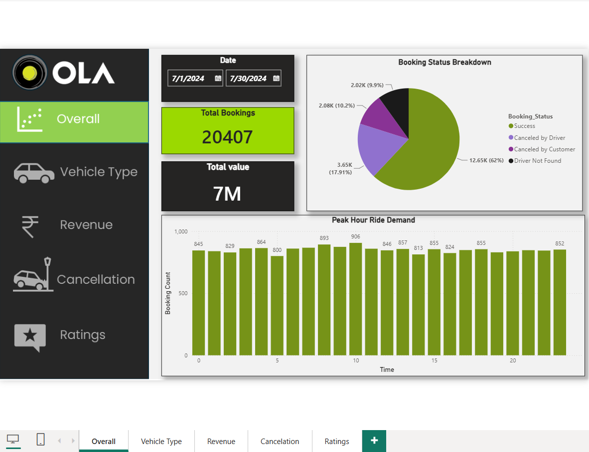
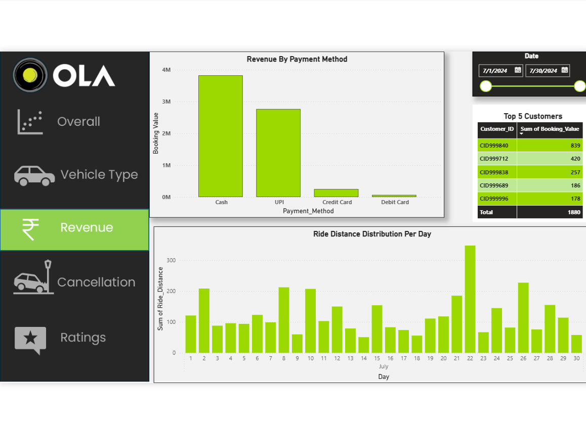
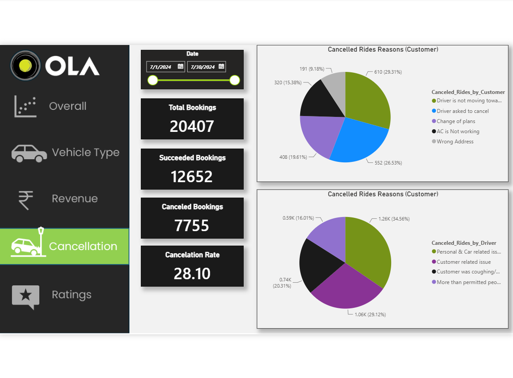

# Ola Data Analysis Project 🚖

📌 Objective
Analyze Ola ride booking data to extract business insights.

## 🛠 Tools Used
- SQL
- Power BI
- Excel

## 📊 Key Insights
- Total 20,407 bookings generated ~₹7M revenue, showing strong platform usage.
- Ride demand remains relatively stable throughout the day (around 800–906 bookings per hour), with the highest demand observed at 10:00 AM (906 bookings), indicating a moderate morning peak.
- Cancellation rate is high (~28%), indicating operational inefficiencies
- Cash and UPI dominate payment methods
- Balanced demand across vehicle types

💡 Recommendations
- Increase driver availability during peak hours
- Reduce cancellations through incentives
- Promote digital payments

## 📷 Dashboard Preview
🔹 Overview Dashboard

🔹 Revenue Dashboard

🔹 Cancellation Dashboard

 

## 🚀 Conclusion
This project helps understand customer behavior, revenue trends, and operational challenges in ride-hailing services.
